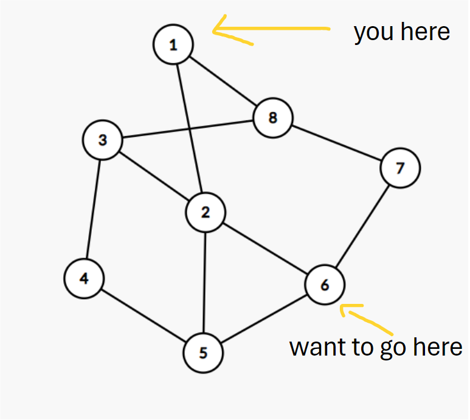
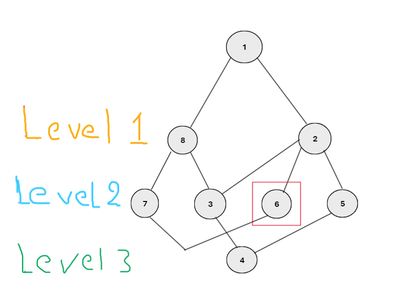
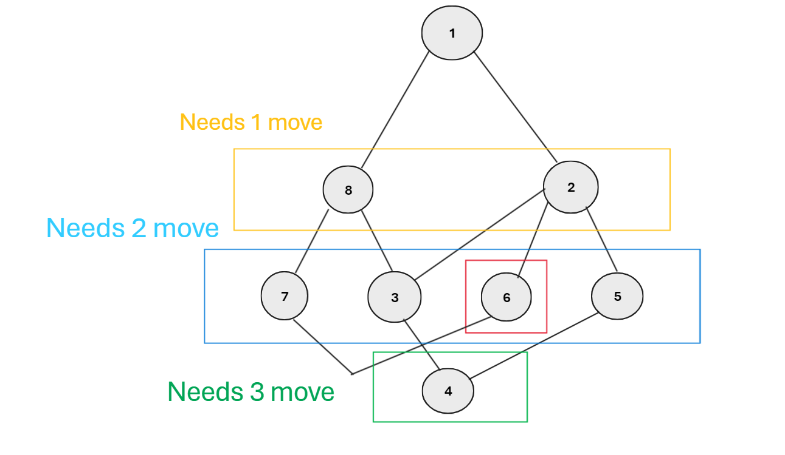

# Smart Path Using BFS in C
This project is a pathfinding algorithm that allows users to input cities and the roads between them. The goal is to compute the shortest path between a starting city and a destination city using the <b>Breadth-First Search (BFS) algorithm.</b> The challenge of this project lies in its implementation in C, where I focused on low-level techniques such as the use of pointers and creating a queue data structure using a linked list.

The program takes in a set of cities, represented by integers, and roads connecting them, and performs BFS to find the shortest path from a given source city to a target city. The BFS algorithm explores the cities level by level and guarantees finding the shortest path in an unweighted graph, making it ideal for this use case.

# Key Features:
- <b>Dynamic Data Structures</b>: The project utilizes a linked list to implement the queue, avoiding fixed-size arrays and taking advantage of C’s low-level memory management.
- <b>BFS Implementation</b>: The core of the algorithm is the Breadth-First Search (BFS) technique, which efficiently finds the shortest path in an unweighted graph.
- <B>Pointer Usage</b>: The code takes full advantage of C’s pointer-based memory management, enhancing the understanding and control over memory usage.

# Challenge:
The main challenge of this project was to implement the algorithm in C while focusing on low-level programming aspects, such as pointer manipulation and dynamic memory allocation. The BFS algorithm was implemented using a linked list-based queue, which demonstrates how low-level concepts can be applied to classic algorithms.

Additionally, a C++ version of the same code will be provided for comparison and clarification.

# Clarifying the idea
The application constructs a Graph using an Adjacency List to optimize data handling and performance. It then utilizes the [BFS (Breadth-First Search)](https://www.geeksforgeeks.org/breadth-first-search-or-bfs-for-a-graph/) algorithm to divide the Graph into levels, ensuring that each node within a level is visited at most once.

This approach guarantees efficient search operations by minimizing the time required to reach the desired nodes. For further clarification, some illustrative images are provided below.
## EXP 1

 ### BFS view

### After dividing it into levels, we can determine the minimum number of steps possible to reach the goal.

