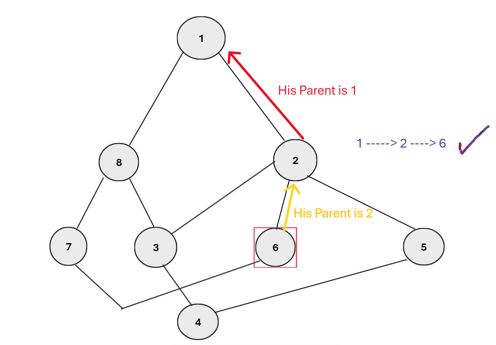

# Smart Path 
This project is a pathfinding algorithm that allows users to input cities and the roads between them. The goal is to compute the shortest path between a starting city and a destination city using the [BFS (Breadth-First Search)](https://www.geeksforgeeks.org/breadth-first-search-or-bfs-for-a-graph/).

The program takes in a set of cities, represented by integers, and roads connecting them, and performs BFS to find the shortest path from a given source city to a target city. The BFS algorithm explores the cities level by level and guarantees finding the shortest path in an unweighted graph, making it ideal for this use case.

# Key Features:
- <b>Dynamic Data Structures</b>: The project utilizes a linked list to implement the queue, avoiding fixed-size arrays and taking advantage of C’s low-level memory management.
- <b>BFS Implementation</b>: The core of the algorithm is the Breadth-First Search (BFS) technique, which efficiently finds the shortest path in an unweighted graph.
- <B>Pointer Usage</b>: The code takes full advantage of C’s pointer-based memory management, enhancing the understanding and control over memory usage.
- <B>GUI display</B>: The road network between cities is drawn in the form of a graph and the correct path is determined by coloring the path in blue and printing that path to avoid the complexity that occurs in the graph network.

# Challenge:
1- The main challenge of this project was to implement the algorithm in C while focusing on low-level programming aspects, such as pointer manipulation and dynamic memory allocation. The BFS algorithm was implemented using a linked list-based queue, which demonstrates how low-level concepts can be applied to classic algorithms.

2 - Use GUI to visualize the output realistically and try to sort the cities in a geometric system to avoid overlapping the cities with each other after displaying them on the screen.

Additionally, a C++ ِ Console version C  ِConsole version  of the same code will be provided for comparison and clarification.

# Clarifying the idea
The application constructs a Graph using an Adjacency List to optimize data handling and performance. It then utilizes the [BFS (Breadth-First Search)](https://www.geeksforgeeks.org/breadth-first-search-or-bfs-for-a-graph/) algorithm to divide the Graph into levels, ensuring that each node within a level is visited at most once.

# Techniques and resources used
- graphics.h library for graphics
- conio.h library To deal with the operating system
- Turtle Python library for graphics(Only in the improved version.)

> We have recorded a video on YouTube explaining the idea and how to use it.(You can visit it from here)[https://www.youtube.com/watch?v=g3orWMzgXCk&t=36s]

This approach guarantees efficient search operations by minimizing the time required to reach the desired nodes. For further clarification, some illustrative images are provided below.
## EXP 1

 ### BFS view

### After dividing it into levels, we can determine the minimum number of moves possible to reach the goal.

### By tracing the target's parent we can get to the source and print that path in reverse.

